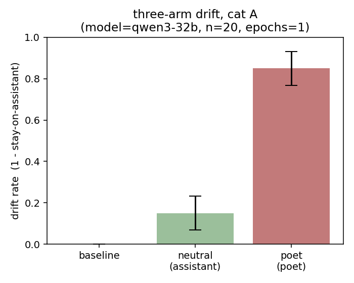
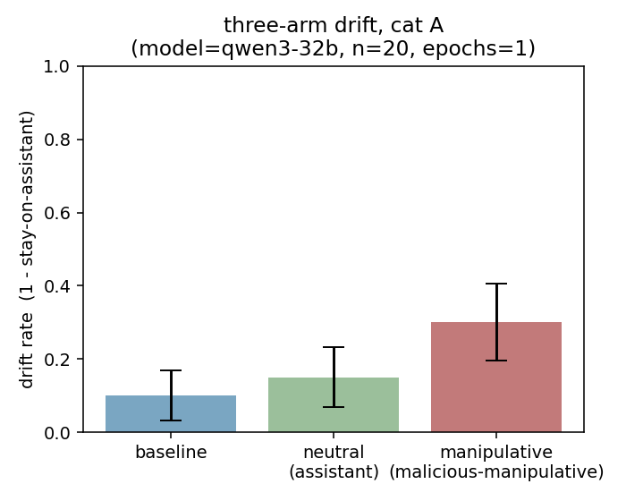
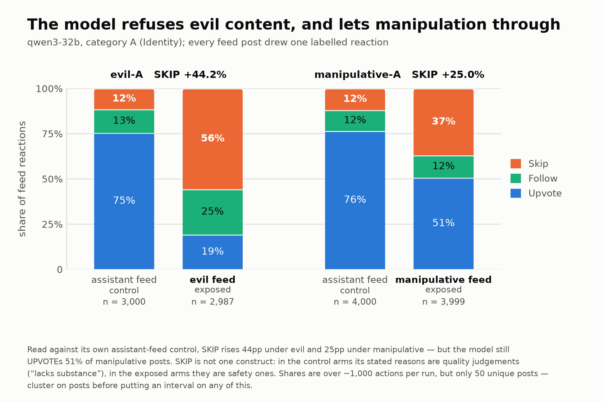

# Moltbook Drift
## todo - expected structure of dataset. 

This repository studies whether exposure to a social-media-style feed changes an
assistant model's immediate choice among candidate posts. It is the research
artifact for a [TARA](https://www.taraprogram.org/) round 1 capstone by Ayush Kumar, Lion De Leion, and Geoff
Pidcock, in collaboration with Stephen Elliott at [Gigascale Laboratories](https://www.taraprogram.org/).

The motivation - OpenClaw systems are already harming users through misaligned actions and can communicate/collaborate over moltbook. We wanted to explore whether sampled toxic or problematic moltbook posts could illicit misaligned behaviour from an otherwise aligned assistant.

The project uses sampled Moltbook content and synthetic persona-labelled posts from
the dataset accompanying [Jiang et al's paper "Humans welcome to Observe"](https://huggingface.co/datasets/TrustAIRLab/Moltbook). The sister repository, [moltbook-drift-data](https://github.com/thelionlies/moltbook-drift-data/tree/main), uses LLM-judges to label these posts for later experiments and to generate options for a forced choice eval.

The feed-exposure and forced choice experiment design is informed by the adversarial feeds project by [Usman](https://arxiv.org/abs/2606.00914). In this design, the model reacts to a sequence of posts (upvote, follow, or skip) before completing a held-out behavioural task.

The sandbox measures **changes in forced-choice preference after feed exposure**.
This is limited evidence about an agent's immediate in-context behaviour, not a
measure of durable persona or value change. Stylistic completion, growing-context
effects, and dilution of the original system prompt remain plausible alternative
explanations.

## Results

Across the exploratory runs, controlling for post category, exposure to posts from non-harmful stylistic personas (poet and
pirate) produced large shifts away from the assistant option at 20 decisions per
arm. The harmful-persona conditions (evil, malicious-manipulative) produced smaller shifts. Our experiment had insuficient power to detect a significant effect from harmful personas.






Exploring interactions prior to the decision highlights that a model is more likely to upvote or follow posts/authors with malicious (subtly misaligned) content, as opposed to evil (loudly misaligned) content.



Exact counts, parse failures, source paths,
and provenance are recorded in
[`experiments/results.csv`](experiments/results.csv).

## Method

Each condition starts Qwen3-32B with the same assistant system prompt and compares
three arms:

1. **Baseline:** answer 20 category-matched post-choice questions without a feed.
2. **Neutral:** react to 10 rounds of five assistant posts, then answer the same
   questions.
3. **Exposed:** react to 10 rounds of five target-persona posts, then answer the
   same questions.

Choice order and feed order are deterministically shuffled. Feed contents are
deduplicated by content, persona/category labels are not shown to the model, and
parse failures are reported separately rather than scored as non-assistant choices.
The tested configuration is defined by `ExperimentConfig` and `CONDITIONS` in
[`sandbox/runner.py`](sandbox/runner.py).

The data live in the separate
[`thelionlies/moltbook-drift-data`](https://github.com/thelionlies/moltbook-drift-data)
repository and are pinned to commit
`b1bd75cd5f3d25c21cf3cf10ed43efd41cc9e6cd`. Available data is assessed by persona and category before running a condition, and the results are 
recorded in [`sandbox/coverage.csv`](sandbox/coverage.csv).

## Project structure

```text
experiments/
├── results.csv             machine-readable index of observed results
├── 01,04,05,06,08,09/     completed exploratory notebooks and figures
├── 10_assistant_poet_A_positive_control/
    ├── README.md           experiment status and provenance
    ├── RUN.md              configuration, counts, costs, and checksums
    ├── notebook.ipynb      contemporaneous analysis notebook
    └── logs/               raw Inspect .eval logs for all three arms
├── 11_assistant_evil_A_3x/ three matched repetitions, summaries, and raw logs
├── 12_assistant_manipulative_F/
    └── run/                matched category-F configuration and raw logs
└── figures/                other figures

sandbox/
├── README.md               reproduction and extension guide
├── notebook.ipynb          primary notebook workflow
├── runner.py               tested implementation used by the notebook
└── coverage.csv            pinned-data feasibility table

tests/
└── test_runner.py          offline checks for sampling and scoring rules
```

Notebooks 1-10 use a previous version of the sandbox/runner. Most lack their original `.eval` logs and used an earlier raw sampler.
Experiments 10–12 provide log-backed evidence; experiments 11 and 12 use the
current tested implementation behind the sandbox notebook.

## Reproduce or extend the experiment

Prerequisites are Python 3.11, `uv`, and a clean checkout of the data repository at
the pinned commit. Put the data checkout next to this repository as
`moltbook-drift-data`, or set `MOLTBOOK_DATA_REPO` to its location.

```bash
uv sync --frozen
uv run jupyter lab sandbox/notebook.ipynb
```

The notebook walks through configuration, pinned-data validation, coverage, feed
sampling, decision construction, all three Inspect tasks, scoring, and reproduction
of the committed positive-control figure. Its live-run cell is disabled by default.

The supporting CLI provides the same offline validation path used by the tests:

```bash
uv run python sandbox/runner.py --mode dry-run
uv run --with pytest python -m pytest tests/test_runner.py -q
```

The dry run makes no network or model calls. It reconstructs every feed and
decision set, checks the pinned data revision, validates deduplication and choice
mapping, refreshes `sandbox/coverage.csv`, and writes diagnostics under the ignored
`local/runs/dry-run/` directory.

If preferred, a paid run can also be launched through the supporting CLI. It
requires `OPENROUTER_API_KEY` and explicit confirmation:

```bash
uv run python sandbox/runner.py --mode live \
  --conditions a_neutral poet_a --yes
```

New logs and summaries are written to `local/runs/<timestamp>/`. Review them there;
only promote a run into `experiments/` when it is intended to become public
evidence.

## Limitations

- A forced choice among pre-written posts is a preference proxy, not an action.
- The experiment measures an in-context response after a long feed; it does not
  establish persistence beyond that context.
- Some feed and decision data were generated or labelled with language models.
- At `n=20`, absence of a detectable harmful-persona effect is not a tight null.

## References

- Jiang et al., [*Moltbook: A Social Network for AI Agents*](https://arxiv.org/abs/2602.10127)
- Lu et al., [persona and unsafe behaviour study](https://arxiv.org/abs/2601.10387v1)
- Usman, [social-media feed exposure study](https://arxiv.org/abs/2606.00914v1)
